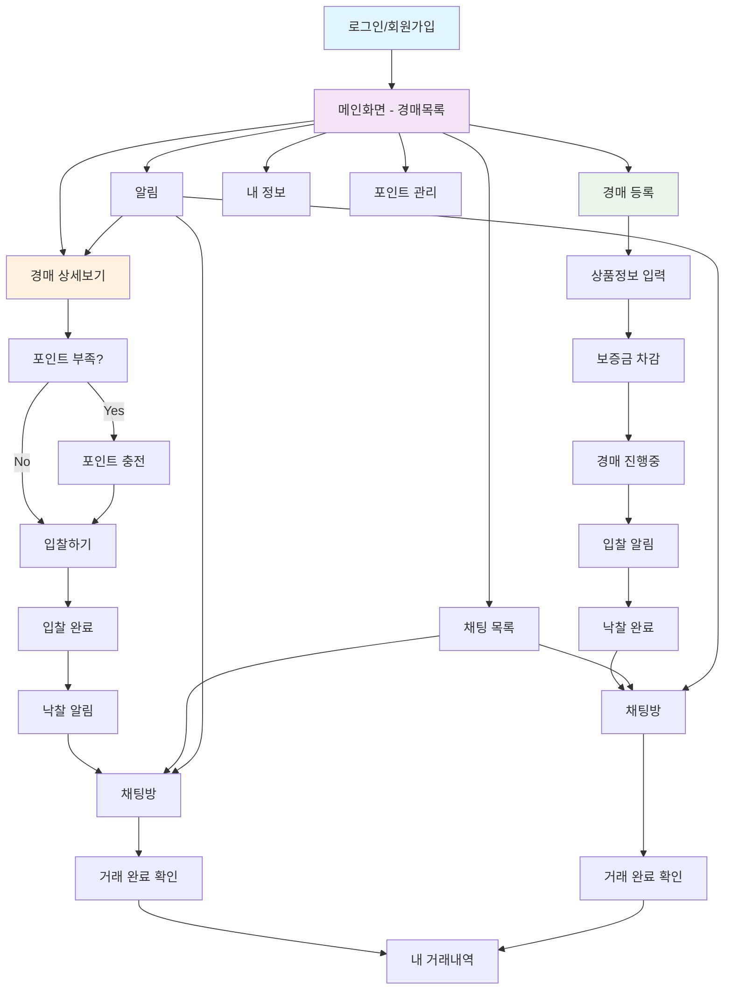

# 📱 CherryPick Screen Flow & Wireframes

**프로젝트**: CherryPick (React Native + Spring Boot)  
**문서 생성일**: 2025-07-28  
**기반 문서**: buyer-scenarios.md, seller-scenarios.md

---

## 🗺️ 전체 화면 흐름도



---

## 📋 화면 분류

### 🔐 인증 화면

- **로그인** (Login)
- **회원가입** (Sign Up)
- **계좌 연결** (Account Link)

### 🏠 메인 화면

- **메인화면** (Home - Auction List with Search)
- **채팅 목록** (Chat List)

### 🛒 구매자 화면

- **경매 상세보기** (Auction Detail)
- **입찰하기** (Place Bid)
- **포인트 충전** (Point Charge)
- **찜 목록** (Wishlist)

### 📝 판매자 화면

- **경매 등록** (Create Auction)
- **내 경매 관리** (My Auctions)

### 💬 거래 화면

- **채팅방** (Chat Room)
- **거래 완료** (Transaction Complete)
- **거래 내역** (Transaction History)

### ⚙️ 사용자 화면

- **알림** (Notifications)
- **내 정보** (My Profile)
- **포인트 관리** (Point Management)

---

## 📱 와이어프레임

### 1. 메인화면 (Home - Auction List)

```
┌─────────────────────────┐
│ ⚡ CherryPick      🔔 💰│ Header
├─────────────────────────┤
│  🔍 [검색창]           │ Search Bar
│  [카테고리] [지역] [가격]  │ Filter Tabs
├─────────────────────────┤
│ ┌─────┐ 아이폰14 Pro     │ Auction Item 1
│ │사진 │ 💰 580,000원     │
│ │     │ ⏰ 14시간 32분   │
│ └─────┘ 👥 5명 입찰중   │
├─────────────────────────┤
│ ┌─────┐ 갤럭시 S23      │ Auction Item 2
│ │사진 │ 💰 420,000원     │
│ │     │ ⏰ 2시간 15분    │
│ └─────┘ 👥 3명 입찰중   │
├─────────────────────────┤
│        더보기...         │ Load More
└─┬───┬───┬───┬───┬───┘
  │홈  │채팅 │찜  │알림 │내정보│ Bottom Navigation
```

**주요 기능:**

- 실시간 경매 목록 표시
- 검색 및 필터링
- 남은 시간 카운트다운
- 입찰자 수 실시간 업데이트

**API 연동:**

- `GET /api/auctions` - 경매 목록 조회
- `GET /api/auctions?category={}&region={}&priceRange={}` - 필터링

---

### 2. 경매 상세보기 (Auction Detail)

```
┌─────────────────────────┐
│ ← 아이폰14 Pro 256GB    │ Header with Back
├─────────────────────────┤
│ ┌─────────────────────┐ │ Image Carousel
│ │    📷 상품사진      │ │
│ │    (슬라이드)       │ │
│ │      1/5           │ │
│ └─────────────────────┘ │
├─────────────────────────┤
│ 💰 현재가: 580,000원    │ Current Price
│ ⏰ 남은시간: 14:32:15   │ Countdown Timer
│ 👥 입찰자: 5명          │ Bidder Count
│ 📍 서울 강남구          │ Location
├─────────────────────────┤
│ 📝 상품 설명           │ Description
│ 아이폰14 프로 256GB... │
│ 구매일: 2023.03       │
│ 상태: 9/10점          │
├─────────────────────────┤
│ 👤 판매자: 홍길동님     │ Seller Info
│ ⭐ 신뢰도: 95% (LV.12) │
│ 📊 판매 10건, 구매 25건│
├─────────────────────────┤
│ [    600,000원에     ] │ Bid Input
│ [      입찰하기      ] │ Bid Button
│ [  관심목록 추가  ] ♡   │ Wishlist
└─────────────────────────┘
```

**주요 기능:**

- 이미지 갤러리 (최소 3장)
- 실시간 가격/시간 업데이트
- 판매자 신뢰도 표시
- 입찰가 자동 계산 (현재가 + 5~10%)

**API 연동:**

- `GET /api/auctions/{id}` - 경매 상세 조회
- `POST /api/auctions/{id}/bids` - 입찰하기
- `POST /api/auctions/{id}/wishlist` - 관심목록 추가

---

### 3. 포인트 충전 (Point Charge)

```
┌─────────────────────────┐
│ ← 포인트 충전           │ Header
├─────────────────────────┤
│ 💰 현재 잔액           │ Current Balance
│    50,000원            │
├─────────────────────────┤
│ 💳 충전할 금액을 선택하세요│ Title
│                        │
│ ┌─ 100,000원 ─┐ 💰    │ Amount Option 1
│ │  입찰 1~2회  │        │
│ └─────────────┘        │
│ ┌─ 200,000원 ─┐ 💰    │ Amount Option 2
│ │  입찰 3~4회  │        │
│ └─────────────┘        │
│ ┌─ 500,000원 ─┐ 💰    │ Amount Option 3
│ │  입찰 8~10회 │        │
│ └─────────────┘        │
│ [ 직접 입력하기  ] ✏️  │ Custom Amount
├─────────────────────────┤
│ 🏦 계좌 연결 (최초 1회) │ Account Section
│ 💳 신한은행 110-123-*** │
│ [  계좌 변경하기  ]     │
├─────────────────────────┤
│ [    충전하기    ] 🔵  │ Charge Button
│ 💡 충전 후 즉시 입찰 가능│ Info Message
└─────────────────────────┘
```

**주요 기능:**

- 자주 사용하는 금액 프리셋
- 계좌 연결 및 변경
- 입찰 가능 횟수 가이드
- 충전 후 원래 화면 복귀

**API 연동:**

- `GET /api/points/balance` - 포인트 잔액 조회
- `POST /api/points/charge` - 포인트 충전
- `POST /api/accounts/link` - 계좌 연결
- `GET /api/accounts/my` - 연결된 계좌 조회

---

### 4. 경매 등록 (Create Auction)

```
┌─────────────────────────┐
│ ← 경매 등록             │ Header
├─────────────────────────┤
│ 📷 상품 사진 (최소3장)  │ Photo Section
│ ┌───┐ ┌───┐ ┌───┐     │
│ │ + │ │ + │ │ + │     │
│ └───┘ └───┘ └───┘     │
│ 💡 다각도로 찍으면 입찰률↑│
├─────────────────────────┤
│ 제목: ________________  │ Title Input
│ 카테고리: [전자제품 ▼]  │ Category Selector
│ 📝 상품 설명:          │ Description
│ ┌─────────────────────┐ │
│ │구매시기, 사용기간,   │ │
│ │상태 등을 자세히...  │ │
│ └─────────────────────┘ │
├─────────────────────────┤
│ 💰 시작가: 500,000원    │ Starting Price
│ 💎 희망가: 700,000원    │ Target Price
│ ⚠️ 보증금: 70,000원     │ Deposit (Auto-calc)
├─────────────────────────┤
│ ⏰ 경매시간: [24시간 ▼] │ Duration
│ 📍 지역: [서울 강남구 ▼]│ Location
├─────────────────────────┤
│ [    등록하기    ] 🔵  │ Submit Button
│ 💡 보증금은 거래완료시 반환│ Info Message
└─────────────────────────┘
```

**주요 기능:**

- 이미지 다중 업로드 (최소 3장)
- 희망가 기반 보증금 자동 계산
- 카테고리 및 지역 선택
- 경매 시간 설정

**API 연동:**

- `POST /api/auctions` - 경매 등록
- `POST /api/uploads/images` - 이미지 업로드
- `GET /api/categories` - 카테고리 목록
- `GET /api/regions` - 지역 목록

---

### 5. 채팅 목록 (Chat List)

```
┌─────────────────────────┐
│ 💬 채팅                │ Header
├─────────────────────────┤
│ ┌─────┐ 홍길동님        │ Chat Item 1
│ │프로필│ 아이폰14 Pro    │
│ │사진 │ 안녕하세요! 언제... │
│ └─────┘ 2시간 전  🔴 1  │
├─────────────────────────┤
│ ┌─────┐ 이영희님        │ Chat Item 2
│ │프로필│ 갤럭시 북3      │
│ │사진 │ 거래 완료했습니다 │
│ └─────┘ 1일 전         │
├─────────────────────────┤
│ ┌─────┐ 김철수님        │ Chat Item 3
│ │프로필│ 맥북 프로       │
│ │사진 │ 내일 만날까요?   │
│ └─────┘ 3일 전         │
├─────────────────────────┤
│        더보기...         │ Load More
└─┬───┬───┬───┬───┬───┘
  │홈  │채팅 │찜  │알림 │내정보│ Bottom Navigation
```

**주요 기능:**

- 진행 중인 채팅방 목록
- 읽지 않은 메시지 표시
- 거래 상품 정보 표시
- 최근 메시지 미리보기

**API 연동:**

- `GET /api/chat/rooms` - 채팅방 목록 조회
- `GET /api/chat/unread-count` - 읽지 않은 메시지 수

---

### 6. 채팅방 (Chat Room)

```
┌─────────────────────────┐
│ ← 홍길동님과의 거래     │ Header with User
├─────────────────────────┤
│        📋 거래정보       │ Transaction Info
│    아이폰14 Pro 256GB   │
│     💰 650,000원        │
│   📍 서울 강남구        │
├─────────────────────────┤ Chat Area
│ 안녕하세요! 낙찰 축하드│ Seller Message
│ 려요 😊               │
│                   14:20│
│                        │
│ 언제 어디서 만날까요?    │ Buyer Message
│ 14:25                   │
│                        │
│     강남역 2번출구는   │ Seller Reply
│     어떠세요?          │
│                   14:27│
│                        │
│ 👍 좋아요! 내일 3시에  │ Buyer Confirm
│ 14:30                   │
├─────────────────────────┤
│ [      거래완료      ] │ Complete Button
├─────────────────────────┤
│ [메시지 입력...] [전송] │ Input Area
└─────────────────────────┘
```

**주요 기능:**

- 실시간 채팅
- 거래 정보 고정 표시
- 거래 완료 버튼 (양측 확인 필요)
- 안전한 거래 가이드라인

**API 연동:**

- `POST /api/chat/rooms` - 채팅방 생성
- `POST /api/chat/send` - 메시지 전송
- `GET /api/chat/messages/{roomId}` - 메시지 목록
- `POST /api/transactions/{id}/complete` - 거래 완료

---

### 7. 찜 목록 (Wishlist)

```
┌─────────────────────────┐
│ ⭐ 찜 목록              │ Header
├─────────────────────────┤
│ ┌─────┐ 아이폰14 Pro     │ Wishlist Item 1
│ │사진 │ 💰 620,000원    │ (최고 입찰가)
│ │     │ ⏰ 5시간 12분   │
│ └─────┘ 👥 7명 입찰중   │
├─────────────────────────┤
│ ┌─────┐ 맥북 프로       │ Wishlist Item 2
│ │사진 │ 💰 580,000원    │
│ │     │ ⏰ 1일 3시간    │
│ └─────┘ 👥 3명 입찰중   │
├─────────────────────────┤
│ ┌─────┐ 갤럭시 워치     │ Wishlist Item 3
│ │사진 │ 💰 150,000원    │ (시작가)
│ │     │ ⏰ 12시간 45분  │
│ └─────┘ 👥 2명 입찰중   │
├─────────────────────────┤
│        더보기...         │ Load More
└─┬───┬───┬───┬───┬───┘
  │홈  │채팅 │찜 목록  │알림 │내정보│ Bottom Navigation
```

**주요 기능:**

- 관심 있는 경매 목록 저장
- 가격 변동 표시 (↗️ 상승, ↘️ 하락)
- 실시간 경매 상태 업데이트
- 전략적 입찰 타이밍 파악
- 탭하면 경매 상세로 이동

**찜의 전략적 활용:**

- **눈치보기**: 다른 입찰자들의 패턴 관찰
- **타이밍 잡기**: 경매 마감 직전 입찰
- **가격 추이**: 시간에 따른 가격 변화 분석
- **경쟁 상황**: 입찰자 수 변화 모니터링

**API 연동:**

- `GET /api/wishlist` - 찜 목록 조회
- `POST /api/wishlist/{auctionId}` - 찜 추가
- `DELETE /api/wishlist/{auctionId}` - 찜 제거
- `GET /api/wishlist/price-alerts` - 가격 변동 알림

---

### 8. 알림 (Notifications)

```
┌─────────────────────────┐
│ 🔔 알림                │ Header
├─────────────────────────┤
│ 📅 오늘                │ Date Section
├─────────────────────────┤
│ 🎉 축하합니다! 낙찰받으셨어요 │ Notification 1
│ 아이폰14 Pro - 650,000원│
│ 15분 전              🔴│
├─────────────────────────┤
│ 💰 김철수님이 입찰했어요  │ Notification 2
│ 갤럭시 S23 - 420,000원 │
│ 1시간 전                │
├─────────────────────────┤
│ 📅 어제                │ Date Section
├─────────────────────────┤
│ ⏰ 경매가 곧 종료됩니다   │ Notification 3
│ 맥북 프로 - 1,200,000원│
│ 오후 3:20               │
├─────────────────────────┤
│ 💬 새 메시지가 있어요    │ Notification 4
│ 홍길동님과의 거래       │
│ 오후 2:15               │
├─────────────────────────┤
│        더보기...         │ Load More
└─┬───┬───┬───┬───┬───┘
  │홈  │채팅 │찜  │알림 │내정보│ Bottom Navigation
```

**주요 기능:**

- 실시간 알림 목록 표시
- 날짜별 그룹핑
- 읽지 않은 알림 표시 (🔴)
- 알림 타입별 아이콘 구분
- 탭하면 해당 화면으로 이동

**알림 종류:**

- 🎉 **낙찰 알림**: 경매 낙찰 시
- 💰 **입찰 알림**: 새로운 입찰 시
- ⏰ **마감 알림**: 경매 종료 임박
- 💬 **메시지 알림**: 새 채팅 메시지
- 📊 **거래 알림**: 거래 완료, 포인트 변동
- 🔔 **시스템 알림**: 공지사항, 업데이트

**API 연동:**

- `GET /api/notifications` - 알림 목록 조회
- `PUT /api/notifications/{id}/read` - 알림 읽음 처리
- `DELETE /api/notifications/{id}` - 알림 삭제
- `GET /api/notifications/unread-count` - 읽지 않은 알림 수

---

### 9. 내 정보 (My Profile)

```
┌─────────────────────────┐
│ ← 내 정보               │ Header
├─────────────────────────┤
│    👤 홍길동님          │ Profile Section
│   ⭐ LV.15 (신뢰도 92%) │
│   🏆 거래 완료 45건     │
├─────────────────────────┤
│ 💰 포인트              │ Point Section
│    잔액: 250,000원     │
│    [충전] [내역] [출금] │
├─────────────────────────┤
│ 📊 나의 활동           │ Activity Section
│ ├─ 🛒 구매 내역 (23)   │
│ ├─ 📝 판매 내역 (22)   │
│ ├─ 💬 채팅방 (3)       │
│ └─ ⭐ 후기 관리        │
├─────────────────────────┤
│ ⚙️ 설정                │ Settings Section
│ ├─ 🔔 알림 설정        │
│ ├─ 🏦 계좌 관리        │
│ ├─ 📍 지역 설정        │
│ └─ 🔒 개인정보 수정    │
├─────────────────────────┤
│ [    로그아웃    ]     │ Logout Button
└─────────────────────────┘
```

**주요 기능:**

- 사용자 레벨 및 신뢰도 표시
- 포인트 관리 (충전/내역/출금)
- 거래 내역 조회
- 각종 설정 관리

**API 연동:**

- `GET /api/users/profile` - 프로필 조회
- `GET /api/points/balance` - 포인트 잔액
- `GET /api/transactions/my` - 거래 내역
- `PUT /api/users/profile` - 프로필 수정

---

## 🎯 핵심 UX 원칙

### ⚡ 성능

- **실시간 업데이트**: 경매 가격, 남은 시간
- **원클릭 입찰**: 포인트 부족 시 자동 충전 안내
- **빠른 로딩**: 이미지 최적화, 무한 스크롤

### 🔒 신뢰 & 안전

- **신뢰도 표시**: 판매자/구매자 레벨 및 평점
- **안전한 거래**: 양측 거래 완료 확인
- **투명한 정산**: 수수료, 보증금 명확 표시

### 📱 모바일 우선

- **터치 최적화**: 큰 버튼, 스와이프 제스처
- **직관적 네비게이션**: 하단 탭, 뒤로가기
- **반응형 디자인**: 다양한 화면 크기 대응

### 🎨 시각적 계층구조

- **색상 시스템**: 성공(녹색), 경고(주황), 위험(빨강)
- **아이콘 활용**: 직관적인 의미 전달
- **타이포그래피**: 중요도에 따른 글자 크기

---

## 🔗 API 연동 요약

| Screen         | Primary APIs                                                    | Real-time Updates                    |
| -------------- | --------------------------------------------------------------- | ------------------------------------ |
| **메인화면**   | `GET /api/auctions`                                             | WebSocket으로 가격/시간 업데이트     |
| **경매상세**   | `GET /api/auctions/{id}`, `POST /api/auctions/{id}/bids`        | 입찰 현황 실시간 반영                |
| **포인트충전** | `POST /api/points/charge`, `POST /api/accounts/link`            | 충전 완료 시 잔액 업데이트           |
| **경매등록**   | `POST /api/auctions`, `POST /api/uploads/images`                | 등록 완료 시 내 경매 목록 업데이트   |
| **채팅목록**   | `GET /api/chat/rooms`, `GET /api/chat/unread-count`             | 새 메시지 알림 실시간 업데이트       |
| **채팅방**     | `POST /api/chat/send`, `GET /api/chat/messages/{roomId}`        | WebSocket으로 실시간 메시지          |
| **찜목록**     | `GET /api/wishlist`, `GET /api/wishlist/price-alerts`           | 가격 변동 알림, 실시간 상태 업데이트 |
| **알림**       | `GET /api/notifications`, `GET /api/notifications/unread-count` | 실시간 알림 푸시, 읽음 상태 업데이트 |
| **내정보**     | `GET /api/users/profile`, `GET /api/points/balance`             | 포인트 변동 시 자동 갱신             |

---

## 📋 개발 체크리스트

### Frontend (React Native)

- [ ] Navigation 구조 설정
- [ ] 상태 관리 (Redux/Context)
- [ ] WebSocket 연결 설정
- [ ] 이미지 업로드 기능
- [ ] 푸시 알림 설정
- [ ] 오프라인 모드 대응

### Backend (Spring Boot)

- [ ] REST API 개발
- [ ] WebSocket 서버 구축
- [ ] 파일 업로드 처리
- [ ] 실시간 알림 시스템
- [ ] 보안 인증/인가
- [ ] 데이터베이스 설계

### Integration

- [ ] API 문서화 (Swagger)
- [ ] 에러 처리 표준화
- [ ] 로깅 시스템 구축
- [ ] 모니터링 설정
- [ ] 배포 파이프라인
- [ ] 성능 테스트

---

**📅 마지막 업데이트**: 2025-07-28  
**🔄 다음 업데이트**: API 명세서 완성 후 상세 인터랙션 추가
